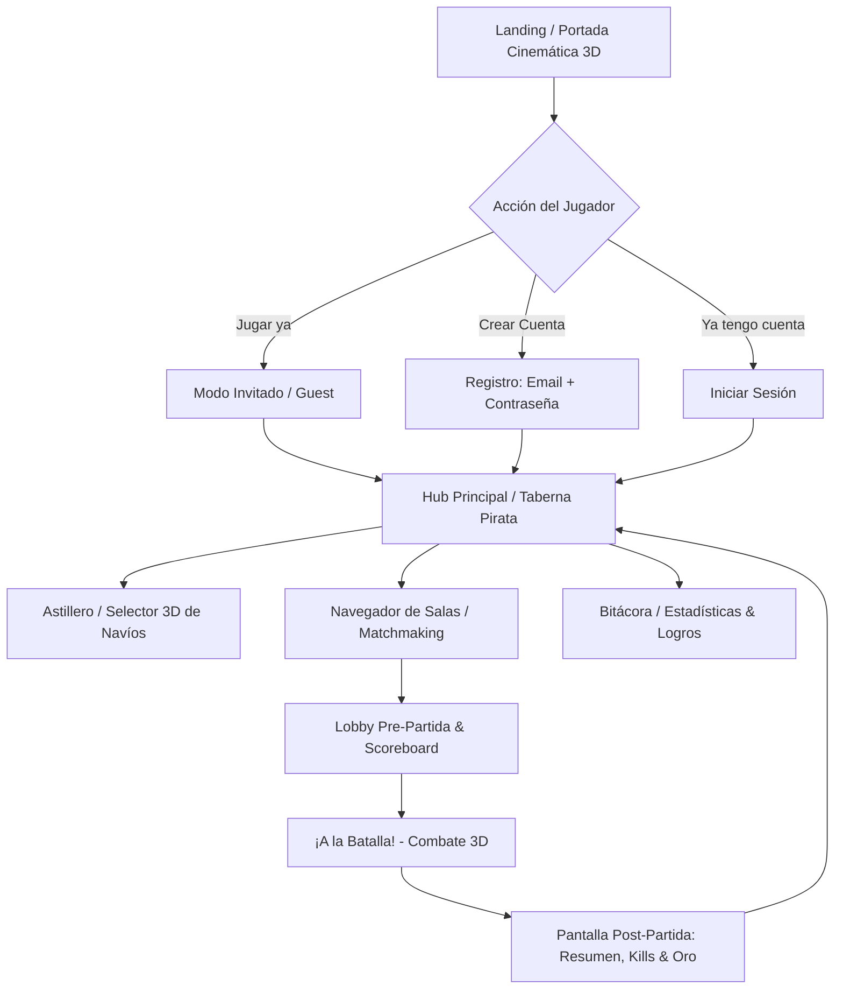

# Roadmap de Producto & Arquitectura: The Pirate Bay

Este documento detalla el plan estratégico, técnico y de experiencia de usuario (UX) para transformar **The Pirate Bay** en una plataforma completa con cuentas de usuario, persistencia, astillero interactivo 3D, salas avanzadas y estadísticas de combate.

---

## 1. Embudo de Experiencia de Usuario (User Journey)

El principio de diseño es **cero fricción para jugar al instante, pero con incentivos claros para registrarse y progresar**.



---

## 2. Definición de Pantallas y Funcionalidades

### A. Pantalla de Bienvenida (Landing / Splash)
- **Fondo Interactivo 3D**: Renderizado en vivo con Three.js mostrando el océano, el sol en el horizonte y un navío fondeado con bandera pirata animada.
- **Botones de Entrada**:
  - `JUGAR COMO INVITADO`: Genera un alias pirata automático (ej. `Capitán_Jack_482`), almacena una sesión en `localStorage` y permite entrar a la partida en un solo clic.
  - `INICIAR SESIÓN` / `REGISTRARSE`: Modal flotante con estética náutica para guardar progreso permanente.
  - Banner informativo: *"Crea tu cuenta para guardar tu oro, kills y desbloquear navíos legendarios"*.
  - Posibilidad de convertir una cuenta de invitado en cuenta registrada sin perder las partidas de esa sesión.

### B. Hub Principal (Menú de la Taberna)
- **Barra Superior (Header)**:
  - Avatar personalizable, Nombre de Capitán, Nivel y barra de progreso de experiencia (XP).
  - Contador de Monedas de Oro.
  - Acceso directo a Perfil y Ajustes.
- **Acceso a Juego**:
  - `PARTIDA RÁPIDA`: Entra automáticamente a la sala pública con más jugadores activos.
  - `LISTA DE SALAS`: Abre el explorador de lobbies.
  - `CREAR SALA`: Permite configurar nombre de sala, modo de juego (Deathmatch o Por Equipos) y límite de jugadores.

### C. El "Astillero" (Ship Selection & Drydock 3D)
- **Inspección 3D**:
  - El navío flota sobre un dique seco o aguas tranquilas; el jugador puede rotarlo 360°, hacer zoom e inspeccionar sus detalles.
- **Ficha Técnica Comparativa**:
  - Barras numéricas y gráficas de atributos:
    - Velocidad máxima y Maniobrabilidad / Radio de giro.
    - Puntos de blindaje y resistencia del casco.
    - Potencia de fuego (Cañón frontal vs Baterías laterales).
- **Personalización Cosmética (Futuro)**:
  - Diseños de velas (Velas negras, rojas, con calaveras).
  - Títulos de barco (ej. *"El Holandés Errante"*).

### D. Explorador de Lobbies & Sala de Espera Pre-Partida
- **Lista de Salas Públicas**:
  - Nombre de la sala, Anfitrión, Modo (FFA / Red vs Blue), Jugadores actuales (ej. `5/8`), Ping estimado.
- **Sala de Espera (Lobby Screen)**:
  - Tabla informativa de tripulantes:
    | Jugador | Nivel | Navío | Bando | Kills Históricas | K/D Ratio | Estado |
    | :--- | :---: | :---: | :---: | :---: | :---: | :---: |
    | ⚓ **Barbanegra** | Lvl 12 | Fragata | 🔴 Red | 148 | 2.4 | Listo |
    | ⛵ **Tolo** | Lvl 8 | Pirata | 🔵 Blue | 89 | 1.8 | Listo |
  - Selector de equipo dinámico con balanceo automático de jugadores.
  - Chat de texto integrado en el lobby.
  - Botón "Listo" para cada participante y botón de inicio para el anfitrión.

### E. HUD en Combate y Scoreboard en Vivo
- **Scoreboard desplegable con `TAB`**:
  - Muestra la tabla de clasificación en tiempo real de la partida:
    - Jugador, Navío, Bajas (Kills), Muertes (Deaths), Daño Total, Latencia (Ping).
  - Marcador general de bando en la parte superior: `🔴 RED: 14 — 🔵 BLUE: 11`.
- **Killfeed (Notificaciones de Bajas)**:
  - Aparece en la esquina superior derecha:
    `Capitán_Tolo [Cañón Frontal] 💥 Corsario_99`

### F. Pantalla de Fin de Partida (Victory / Defeat Summary)
- Al concluir el límite de tiempo o alcanzar las bajas objetivo:
  - Cámara cinemática orbital alrededor del navío MVP.
  - Cuadro de honor: Jugador con más bajas y jugador con más daño infligido.
  - Desglose de recompensas ganadas:
    - `+200 XP` (Progreso de nivel).
    - `+120 Oro` (Para compras en astillero).
  - Botón para volver al Hub o jugar revancha en la misma sala.

---

## 3. Arquitectura Técnica y Base de Datos

```mermaid
graph LR
    subgraph Cliente (React + Three.js)
        UI[React UI / Tailwind / HUD]
        Game[Motor Three.js]
    end

    subgraph Servidor (Node.js)
        API[API REST / Auth: JWT + Bcrypt]
        Sockets[Socket.io Game Loop 60fps]
    end

    subgraph Persistencia
        DB[(PostgreSQL / SQLite / Supabase)]
    end

    UI -->|Login, Registro, Perfil| API
    API --> DB
    UI -->|Conexión a Partida con JWT| Sockets
    Sockets -->|Al finalizar partida: guarda Kills y Oro| DB
```

### Esquema de Base de Datos Recomendado

#### Tabla `users`
| Campo | Tipo | Descripción |
| :--- | :--- | :--- |
| `id` | UUID (PK) | Identificador único |
| `username` | VARCHAR(32) | Nombre de usuario (Único) |
| `email` | VARCHAR(128) | Correo electrónico (Opcional en invitados) |
| `password_hash` | VARCHAR(255) | Hash Bcrypt (Null en invitados) |
| `is_guest` | BOOLEAN | Indica si la cuenta es temporal |
| `gold` | INTEGER | Oro acumulado |
| `level` | INTEGER | Nivel pirata |
| `xp` | INTEGER | Puntos de experiencia acumulados |
| `created_at` | TIMESTAMP | Fecha de registro |

#### Tabla `user_stats`
| Campo | Tipo | Descripción |
| :--- | :--- | :--- |
| `user_id` | UUID (FK) | Relación con `users` |
| `total_kills` | INTEGER | Total histórico de barcos hundidos |
| `total_deaths` | INTEGER | Total histórico de veces hundido |
| `matches_played` | INTEGER | Partidas jugadas |
| `matches_won` | INTEGER | Victorias conseguidas |
| `damage_dealt` | BIGINT | Daño total infligido |

#### Tabla `match_history`
| Campo | Tipo | Descripción |
| :--- | :--- | :--- |
| `id` | UUID (PK) | Identificador de partida |
| `lobby_name` | VARCHAR(64) | Nombre de la sala |
| `winner_team` | VARCHAR(16) | Equipo ganador ("red" / "blue" / "ffa") |
| `duration_sec` | INTEGER | Duración del combate |
| `scores_json` | JSONB | Resumen de kills, muertes y daño por jugador |
| `played_at` | TIMESTAMP | Fecha y hora de la partida |

#### Tabla `achievements` (Logros)
- *"Tirador Certero"*: Acertar 50 disparos a larga distancia.
- *"Terror del Caribe"*: Hundir 5 barcos en una sola partida.
- *"Bautismo de Fuego"*: Hundir tu primer navío.
- *"Superviviente"*: Salir victorioso con menos del 10% de vida.

### G. Sistema de Cazarrecompensas: Contratos de Sangre (Bounty Hunting)
Una de las mecánicas dinámicas más inmersivas para incentivar el PvP cruzado entre salas:

- **El Tablón de Se Busca (Bounty Board)**:
  - En la Taberna/Hub aparece una lista de capitanes actualmente conectados en combate que tienen contratos sobre sus cabezas (jugadores con rachas de kills, alto nivel o seleccionados por el sistema).
  - El contrato detalla: Nombre del Capitán objetivo, Navío que comanda, Sala donde está combatiendo y Recompensa en Oro (ej. `🪙 350 Oro`).
- **Infiltración en la Partida**:
  - Al presionar *"Aceptar Contrato"*, el jugador se conecta directamente como rival a la sala de su presa.
- **Tensión & Alarma Temprana para la Presa**:
  - En el HUD de la víctima suena una campana náutica de emergencia con un aviso visual parpadeante:
    > `⚠️ ¡PRESA MARCADA! El Cazador [Nombre] ha tomado un contrato por tu cabeza y acaba de entrar a tus aguas.`
  - Ambos navíos reciben marcas visuales sutiles de combate (ícono de calavera carmesí o mira sobre el mástil y en el minimapa).
- **Resolución & Recompensa Cruzada**:
  - **Si el Cazador lo hunde**: Cobra el botín del contrato íntegro + bonificación de experiencia (XP).
  - **Si la Presa hunde a su Cazador ("Cazador Cazado")**: La presa se queda con la recompensa del contrato por defender su honor.

---

## 4. Fases de Implementación Sugeridas

1. **Fase A: Autenticación Híbrida (Invitado + Cuentas + Google)**
   - UI implementada en React (modo Invitado con nombres aleatorios + tabs de Login/Registro).
   - Endpoints `/api/auth/guest`, `/api/auth/google`, `/api/auth/register`, `/api/auth/login`.
   - Generación de token JWT común para Socket.io y almacenamiento en cliente.
2. **Fase B: Hub Principal & Astillero 3D**
   - Nueva interfaz de navegación con inspección rotatoria de barcos en Three.js.
3. **Fase C: Scoreboard & Persistencia de Partidas**
   - Envío de reporte de fin de partida desde Socket.io hacia la base de datos.
   - Pantalla de Scoreboard con tecla `TAB` en combate y killfeed en tiempo real.
4. **Fase D: Logros, Niveles & Economía**
   - Sistema de XP y desbloqueo de barcos con monedas de oro acumuladas.
5. **Fase E: Contratos de Cazarrecompensas (Bounty Hunting)**
   - Algoritmo de detección de capitanes objetivo activos en salas.
   - Sistema de alertas sonoras/HUD y recompensas de contrato al cazar o sobrevivir.

