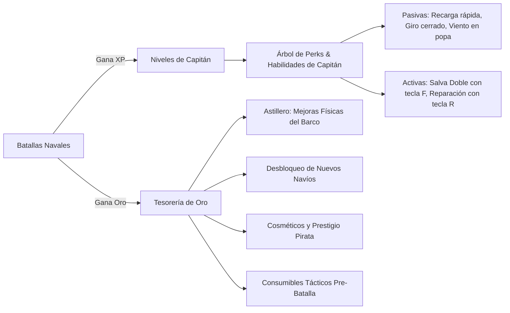
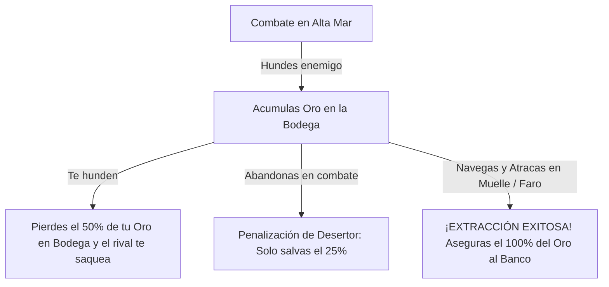

# 🗺️ Roadmap de Producto & Arquitectura: The Pirate Bay

Este documento detalla el estado actual del desarrollo, las características completadas y la hoja de ruta técnica y de producto para **The Pirate Bay**.

---

## 📊 Estado Actual del Proyecto (Changelog de Features)

### ✅ 1. Persistencia y Base de Datos (Completado)
- [x] **Base de Datos PostgreSQL (Neon Serverless)**: Conexión SSL robusta configurada y testeada.
- [x] **Esquema de Tablas (`schema.sql`)**:
  - `users`: Registro permanente e invitados, email, contraseña con hash bcrypt, avatar, oro acumulado, nivel y XP.
  - `user_stats`: Registro histórico acumulativo de kills, deaths, daño total, partidas jugadas y ganadas.
  - `match_history`: Historial de partidas, ganadores, duración y desglose JSON de estadísticas.
- [x] **Servicio de Autenticación (`AuthService.ts` / `UserRepository.ts`)**:
  - Generación y verificación de tokens JWT seguros.
  - Registro de usuarios con validación de credenciales.
  - Inicio de sesión con email o username.
  - Modo Invitado instantáneo persistido en base de datos.
  - Inicio de sesión y registro con Google OAuth (Google Identity Services con verificación de ID Token oficial).
  - Endpoints REST `/api/auth/*` integrados con Express.

### ✅ 2. Experiencia de Entrada y Menú (Completado)
- [x] **Tabs de Acceso Modular**:
  - **Invitado**: Nombre personalizable o generador de apodos piratas aleatorios (`🎲 Aleatorio`) con entrada en 1 clic sin fricción.
  - **Iniciar Sesión**: Formulario de credenciales con estética naval oscura + botón oficial de Google.
  - **Registrarse**: Creación de cuenta con confirmación de contraseña + botón de Google.
- [x] **Persistencia de Sesión Local**: Guardado de JWT en `localStorage`, decodificación de datos y sesión persistente al recargar la página.
- [x] **Barra de Estado del Capitán**: Indicador de rango ("Invitado" / "Capitán"), balance de oro y botón de cambio de capitán.

### ✅ 3. Enrutamiento, Navegación y Control de Flujo (Completado)
- [x] **Soporte Completo de Historial de Navegador (`popstate` / Hashes)**:
  - Navegación clara con URLs amigables: `#menu`, `#lobbies`, `#lobby/:id`, `#battle`.
  - El botón "Atrás" y "Adelante" del navegador ya no expulsan al usuario de la aplicación.
  - Salida ordenada de lobbies notificando al servidor de forma limpia al retroceder.
- [x] **Menú de Pausa In-Game (`ESC` / ⚙️)**:
  - Componente modal `GamePauseMenu.tsx` integrado en la vista de batalla.
  - Modal con confirmación para "Abandonar Batalla" y volver ordenadamente a la lista de salas.
  - Guía rápida de controles integrada dentro del menú de pausa.

### ✅ 4. Sistema de Lobbies y Matchmaking (Completado)
- [x] **Creación y Explorador de Salas**:
  - Configuración de nombre de sala y límite de jugadores (2 a 8).
  - Lista de salas en vivo con actualización reactiva vía WebSockets (`lobbiesUpdated`).
- [x] **Sala de Espera (Pre-Battle Lobby)**:
  - Selección de barco (*El Temido Pirata* vs *Man-o-War Inglés* / Fragata) con ficha comparativa de atributos.
  - Selección de escuadra (*Imperio Rojo* vs *Armada Azul*).
  - **Corrección de sincronización**: Idempotencia al unirse (`onJoin`), eliminando duplicados o jugadores fantasma (`"Jugador"`).
  - Botón de salida de sala con desvinculación automática en el servidor.

### ✅ 5. Combate 3D, HUD, Marcador y Feed (Completado)
- [x] **Marcador Desplegable con Tecla `TAB` (`ScoreboardModal.tsx`)**:
  - División visual en dos escuadras: **Armada Azul** vs **Imperio Rojo**.
  - Estadísticas individuales en tiempo real: Capitán, Navío, Bajas (Kills), Hundimientos (Deaths), Daño Infligido y Estado (*A flote* / *Hundido*).
  - Distintivo visual dorado `[TÚ]` para identificar al jugador local.
- [x] **Chat de Texto en Vivo (`ChatComponent.tsx`)**:
  - Canales separados: **`[TODOS]`** (chat global de sala) y **`[EQUIPO]`** (únicamente compañeros de escuadra).
  - Enfoque instantáneo con tecla `ENTER` global en combate.
  - Protección de controles: mientras se escribe en el chat, el barco no se mueve ni dispara accidentalmente.
  - Alternancia de canal con clic o tecla `TAB` dentro del input; tecla `Escape` para cancelar y desenfocar.
  - Colores por escuadra, auto-scroll y botón de minimizar (`▲` / `▼`).
- [x] **Killfeed Flotante (`Killfeed.tsx`)**:
  - Notificaciones flotantes animadas en la esquina superior derecha (`⚔️ Corsario_38 💥 Calicó_16`).
  - Detección precisa de hundimientos en el servidor con cálculo de atacante, víctima y equipos.
  - Distintivo dorado `[TÚ]` para el jugador local y desvanecimiento suave tras 4.5 segundos.

---

## 💡 Diseño del Sistema: Progresión de Niveles (XP) vs Economía de Oro

Para lograr un bucle de juego altamente adictivo y equilibrado, separamos la progresión en **dos ejes complementarios**:



### 🧠 Eje 1: Árbol de Habilidades del Capitán (Skill Tree por Niveles)
A medida que ganas XP y subes de nivel, obtienes **Puntos de Capitán** para invertir en un árbol de talentos con 3 ramas especializadas en el menú/taberna:

```mermaid
graph TD
    subgraph Rama de Fuego: Artillería
        A1[1. Pólvora Seca: +5% vel. proyectil] --> A2[2. Recarga Diestra: -12% cooldown]
        A2 --> A3[3. Balas Perforantes: Ignora blindaje]
        A3 --> A4[★ Habilidad Activa F: Salva Furiosa doble cadencia 5s]
    end

    subgraph Rama de Viento: Maniobra
        B1[1. Viento en Popa: +8% vel. punta] --> B2[2. Giro de Ancla: +20% viraje]
        B2 --> B3[3. Espolón Letal: Daño masivo por embestida]
        B3 --> B4[★ Habilidad Activa G: Bruma Fantasmal cortina de niebla]
    end

    subgraph Rama de Hierro: Supervivencia
        C1[1. Roble Curado: -10% daño recibido] --> C2[2. Achique Veloz: Regen fuera de combate]
        C2 --> C3[3. Quilla Blindada: +150 HP base]
        C3 --> C4[★ Habilidad Activa R: Reparación de Emergencia +200 HP]
    end
```



#### Reglas del Árbol:
- Cada jugador puede crear su propia **"Build de Capitán"** (ej. *Sniper de larga distancia*, *Barco ariete ultra rápido*, o *Tanque acorazado con auto-reparación*).
- Posibilidad de reiniciar puntos en la taberna para probar diferentes combinaciones.
- En combate, las habilidades activas desbloqueadas se activan con las teclas **`F`**, **`R`** o **`G`** con sus respectivos tiempos de recarga (cooldowns) reflejados en el HUD.

---

### 🪙 Eje 2: Para qué sirve el Oro (Economía Pirata y Astillero)
El oro es la moneda acumulativa que se invierte en el **Astillero** para mejoras de casco, cañones, timones, cosméticos y nuevos navíos.

---

## ☠️ Mecánica Tryhard: "La Codicia del Caribe" (Extracción & Riesgo Real de Oro)

Para que el juego tenga tensión real y adrenalina constante, el oro no se regala simplemente: **se arriesga y se extrae**.



### 1. Oro en Bodega (Loot en Riesgo) vs Oro Seguro (En el Banco)
- **Oro en Bodega (`goldInHold`)**: Todo el oro que vas acumulando durante la partida actual (por causar daño, hundir enemigos y rachas). Este oro **está en riesgo** mientras navegues en aguas abiertas.
- **Oro en el Banco**: El oro guardado de forma permanente en PostgreSQL en tu cuenta de usuario, listo para gastarse en el Astillero.

### 2. Botín Escalado por Nivel y Racha del Rival
- Hundir a un novato da un botín modesto (ej. `🪙 30 Oro`).
- Hundir a un capitán de mayor nivel o con una racha de kills otorga una recompensa mucho mayor:
  $$\text{Botín} = \text{Base (50)} + (\text{Nivel del Rival} \times 15) + (\text{Oro en su Bodega} \times 0.40)$$
- **Saqueo directo**: El asesino le roba un porcentaje del oro que la víctima llevaba en su bodega en ese momento.

### 3. Penalización por Naufragio y Muerte
- Si tu barco es hundido:
  - Pierdes el **50% del oro** que tenías en la bodega en esa partida.
  - La víctima reaparece con la bodega a la mitad y debe decidir si volver a pelear o huir a asegurar lo que le queda.

### 4. Cofre de Botín Flotante (Floating Loot Chest Drop) 🏴‍☠️📦
- **Comportamiento Actual**: Por ahora, el oro se acredita directamente en bodega al destruir/romper al navío rival (75 oro base + 50% del botín saqueado de la víctima). Se eliminó el oro por daño parcial.
- **Siguiente Iteración (Cofre Físico en el Agua)**:
  - Al destruirse un navío, en sus coordenadas de muerte `(x, y, z)` aparece un **Cofre del Tesoro 3D** flotando y cabeceando sobre las olas del océano.
  - **Mecánica de Recolección**: El cofre no se acredita automáticamente a distancia; los capitanes deben maniobrar y **pasar físicamente por encima del cofre** para recogerlo.
  - **Robo y Carroñeo**: Cualquier jugador (el asesino, un aliado o un tercer pirata oportunista) puede navegar hasta el cofre y quedarse con el botín.
  - **Baliza Visual y Despawn**: El cofre emite un haz de luz dorada visible a media distancia y permanece flotando durante 45 segundos antes de hundirse en el fondo marino.
  - **Feedback In-Game**: Sonido de tintineo de monedas `coins_pickup` y texto flotante dorado `+X 🪙 Botín Reclamado`.

### 5. La Extracción: "Atracar en Puerto" (100% del Botín)
- En el mapa se ubica un **Muelle / Fuerte Pirata / Faro Seguro**.
- Para asegurar el botín, el jugador debe navegar hasta la zona de atraque, echar el ancla y resistir fondeado durante **5 segundos**:
  - Si no recibe daño durante los 5 segundos, la extracción se completa: **abandona la partida con el 100% del oro acreditado a su cuenta**.
- **Si abandona desde el Menú de Pausa (ESC) en medio del mar**:
  - Se le considera **Desertor** y solo se le permite salvar el **25% - 40%** del oro que llevaba en la bodega.

### 6. La Tensión de la Codicia
- Genera el dilema constante de todo gran juego de supervivencia/extracción:
  > *"¿Me quedo a hundir un barco más arriesgándome a perder la mitad de mi fortuna, o navego al puerto a asegurar mis 600 monedas de oro?"*

#### 1. Mejoras de Piezas del Navío (Hardware Upgrades)
Mejoras permanentes que se compran con oro para personalizar el rendimiento de cada barco:
- **Blindaje del Casco**:
  - Nivel I (+50 HP) → `🪙 200 Oro`
  - Nivel II (+100 HP) → `🪙 450 Oro`
  - Nivel III (+180 HP) → `🪙 800 Oro`
- **Forja de Cañones de Bronce**:
  - Aumenta la velocidad del proyectil y el daño base (+5 / +10 / +15 de daño) → `🪙 300 / 600 / 1.000 Oro`
- **Velas de Lino Fino**:
  - Mayor aceleración para alcanzar velocidad máxima rápidamente → `🪙 250 / 500 Oro`
- **Timón Reforzado de Doble Rueda**:
  - Mayor agilidad para esquivar proyectiles rivales → `🪙 200 / 400 Oro`

#### 2. Compra y Desbloqueo de Nuevos Navíos
En vez de tener solo 2 barcos iniciales, el oro permite adquirir nuevos navíos con roles tácticos únicos:
- **Balandra Corsaria (Sloop)**: Navío ligero, muy ágil y difícil de acertar, ideal para tácticas relámpago → `🪙 600 Oro`.
- **Bergantín de Tres Palos**: Navío balanceado con velocidad y cañones equilibrados → `🪙 1.200 Oro`.
- **Galeón Pesado de Guerra**: Fortaleza flotante con 6 cañones por banda y casco titánico → `🪙 2.500 Oro`.
- **El Holandés Espectral**: Navío legendario con diseño fantasmal y estela luminosa → `🪙 5.000 Oro`.

#### 3. Cosméticos y Prestigio Pirata (Skins Náuticas)
- **Velas Personalizadas**: Velas Negras con Calavera de Huesos, Velas Carmesí del Imperio, Velas Esmeralda.
- **Pintura y Madera del Casco**: Madera de Ébano Negra, Roble Dorado Brillante, Blanco Fantasmal.
- **Mascarones de Proa (Esculturas 3D en la punta del barco)**: Sirena de Oro, Dragón Escupefuego, Esqueleto Pirata con Farol.
- **Banderas y Gallardetes del Mástil**: Bandera Jolly Roger tradicional, Banderas de fuego.

#### 4. Consumibles Tácticos Pre-Partida (Gasto de Oro por Batalla)
Pequeñas ventajas consumibles que dan salida continua al oro para que nunca pierda valor:
- *Barriles de Pólvora Refinada* (`🪙 30 Oro`): +10% de daño en cañones en la siguiente partida.
- *Munición Encadenada* (`🪙 50 Oro`): 3 disparos especiales que ralentizan un 40% al barco impactado.
- *Kit de Calafateo Extra* (`🪙 40 Oro`): Un uso único de reparación rápida en el mar.

---

## 🎯 Próximas Funcionalidades (Roadmap Priorizado)

```mermaid
flowchart TD
    subgraph Fase 1: Ciclo de Partida y Persistencia (En Progreso)
        A[Fin de Partida: Victoria / Derrota] --> B[Guardado en DB: Acreditación de Kills, Oro y XP]
        B --> C[Pantalla de Resultados Post-Match / Cuadro de Honor]
    end

    subgraph Fase 2: Astillero y Progresión
        D[Astillero 3D: Inspección rotatoria e interactiva]
        E[Sistema de Niveles & Selector de Perks del Capitán]
        F[Tienda de Mejoras de Barco con Oro]
    end

    subgraph Fase 3: Contratos y Economía Viva
        G[Tablón de Se Busca: Cazarrecompensas con Contratos de Oro]
        H[Desbloqueo de Nuevos Navíos con Oro]
        I[Cosméticos de Velas y Mascarones de Proa]
    end

    Fase 1 --> Fase 2
    Fase 2 --> Fase 3
```

---

## 🚀 Fase 1: Fin de Partida y Acreditación de Oro/XP (Siguiente Paso Inmediato)

### 1.1 Pantalla de Fin de Partida (Post-Match Summary)
- **Condición de Victoria**:
  - Límite de bajas alcanzado por un equipo (ej. 10 kills) o finalización del cronómetro.
- **Flujo**:
  1. El servidor detecta la victoria de la **Armada Azul** o del **Imperio Rojo** y emite `matchEnded`.
  2. Los controles se congelan y aparece el telón de victoria/derrota:
     - **¡VICTORIA PIRATA!** o **¡DERROTA NAVAL!**.
     - **MVP del Combate**: Capitán con más bajas y capitán con más daño.
     - **Desglose de Recompensas**:
       - Ganador: `+200 Oro` y `+400 XP`.
       - Derrota / Participación: `+80 Oro` y `+150 XP`.
       - Bonus por baja: `+25 Oro` y `+50 XP` por cada navío hundido.
     - Botón para volver al lobby o buscar nueva partida.

### 1.2 Persistencia Directa en PostgreSQL
- Al finalizar la batalla, el servidor ejecuta:
  - `INSERT INTO match_history` con `scores_json`.
  - `UPDATE user_stats`: suma `total_kills`, `total_deaths`, `damage_dealt`, `matches_played`, `matches_won`.
  - `UPDATE users`: acredita el `gold` ganado y calcula el nuevo `level` y `xp` alcanzado.
